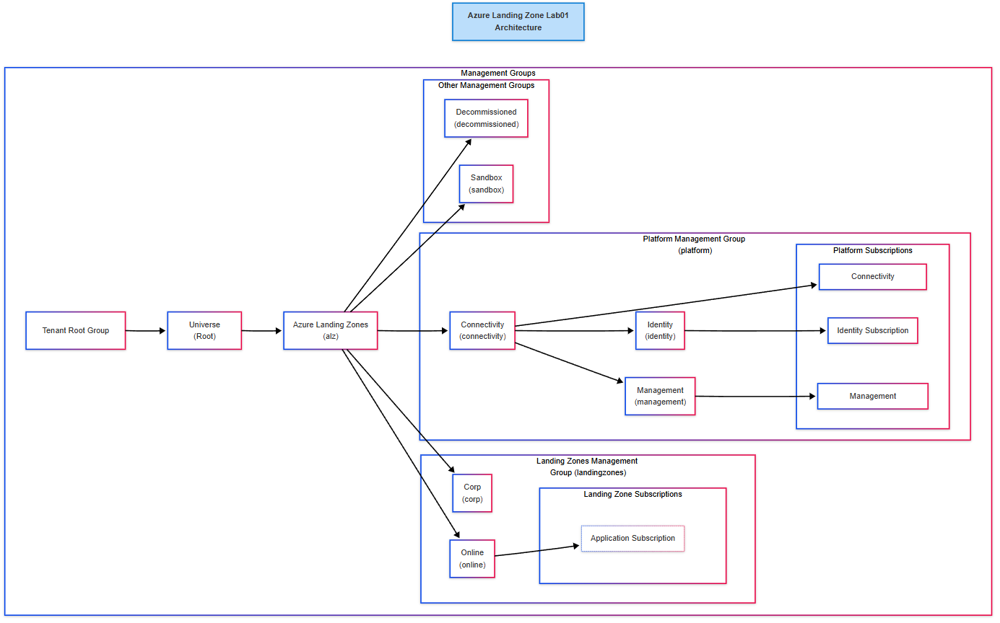
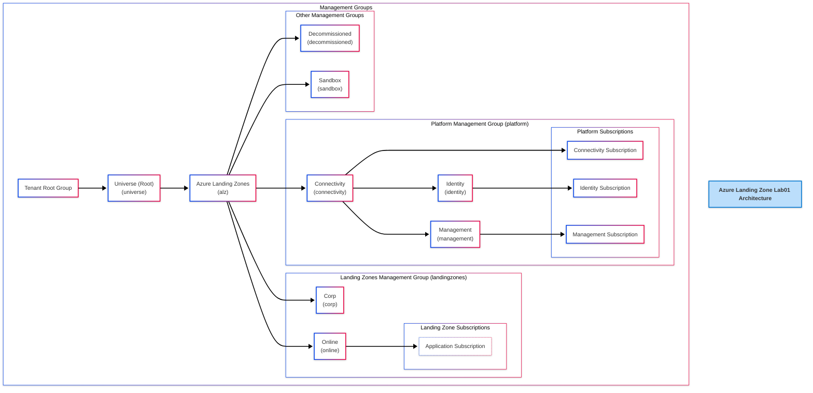
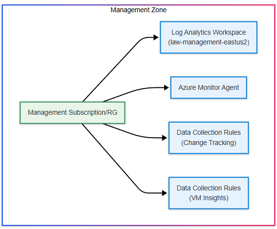
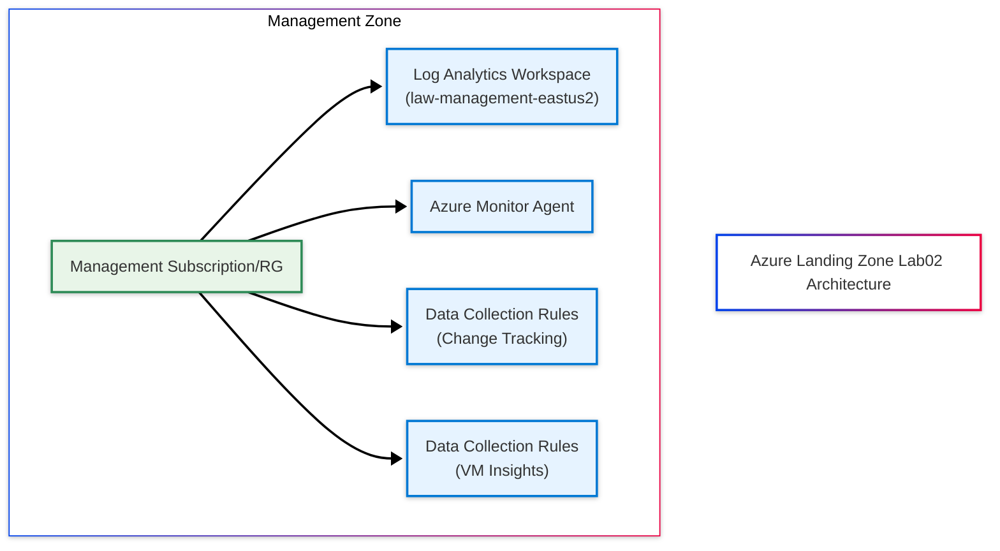

# azure-arch-landing-zone-lab01
===
Description: Azure Landing Zone - Platform Zone

Azure Landing Zone is an Azure architecture adoption framework, a collection of foundational infrastructure and governance controls that align with best practices. It comprises Platform Layer, Application Layer. 

Following the ALZ documentation, using the Terraform - Azure Verified Modules for Platform Landing Zone (ALZ), the management groups were architected and the Azure policies were deployed.
https://azure.github.io/Azure-Landing-Zones/

## Files modified outside of Accelerator generator
- azure-arch-landing-zone-lab01\bootstrap\v4.8.0\alz\local\storage-containers.tf

## Key Components
**Management Layer:**
- Management Groups hierarchy following ALZ patterns
- Three core subscriptions (Identity, Connectivity, Management)
- Azure Monitor Agent and Data Collection Rules for observability

## Diagrams
### Platform Zones

### Management Zones

## Azure Policy Assignments
Below Azure policies were deployed and assigned to corresponding zones by the terraform IaC. These policies can be served as a baseline for enterprise environment.
| Policy Name | Scope | Type |
|-------------|-------|------|
| Configure Azure Activity logs to stream to specified Log Analytics workspace | Azure Landing Zones | Policy |
| Deny virtual machines and virtual machine scale sets that do not use managed disk | Azure Landing Zones | Policy |
| Deny the deployment of classic resources | Azure Landing Zones | Policy |
| Resource Group and Resource locations should match | Azure Landing Zones | Policy |
| Enforce Azure Compute Security Baseline compliance auditing | Azure Landing Zones | Initiative |
| Configure Azure Defender to be enabled on SQL Servers and SQL Managed Instances | Azure Landing Zones | Initiative |
| Configure Advanced Threat Protection to be enabled on open-source relational databases | Azure Landing Zones | Initiative |
| Deploy Microsoft Defender for Cloud configuration | Azure Landing Zones | Initiative |
| Configure multiple Microsoft Defender for Endpoint integration settings with Microsoft Defender for Cloud | Azure Landing Zones | Initiative |
| [Preview]: Deploy Microsoft Defender for Endpoint agent | Azure Landing Zones | Initiative |
| Enable category group resource logging for supported resources to Log Analytics | Azure Landing Zones | Initiative |
| Microsoft Cloud Security Benchmark | Azure Landing Zones | Initiative |
| Resources should be Zone Resilient | Azure Landing Zones | Initiative |
| Unused resources driving cost should be avoided | Azure Landing Zones | Initiative |
| Audit virtual machines for Trusted Launch support | Azure Landing Zones | Initiative |
| Virtual networks should be protected by Azure DDoS Network Protection | Connectivity | Policy |
| ASC Default (subscription: 26e412fd-8753-4d07-8a74-384234118eae) | Homelab Subscription | Initiative |
| Configure backup on virtual machines without a given tag to a new recovery services vault with a default policy | Identity | Policy |
| Subnets should have a Network Security Group | Identity | Policy |
| Deny the creation of public IP | Identity | Policy |
| Management port access from the Internet should be blocked | Identity | Policy |
| Subnets should be private | Landing Zones | Policy |
| Kubernetes clusters should be accessible only over HTTPS | Landing Zones | Policy |
| Virtual networks should be protected by Azure DDoS Network Protection | Landing Zones | Policy |
| Configure backup on virtual machines without a given tag to a new recovery services vault with a default policy | Landing Zones | Policy |
| Deploy Threat Detection on SQL servers | Landing Zones | Policy |
| Deploy TDE on SQL servers | Landing Zones | Policy |
| Configure SQL servers to have auditing enabled to Log Analytics workspace | Landing Zones | Policy |
| Subnets should have a Network Security Group | Landing Zones | Policy |
| Secure transfer to storage accounts should be enabled | Landing Zones | Policy |
| Kubernetes cluster should not allow privileged containers | Landing Zones | Policy |
| Kubernetes clusters should not allow container privilege escalation | Landing Zones | Policy |
| Management port access from the Internet should be blocked | Landing Zones | Policy |
| Network interfaces should disable IP forwarding | Landing Zones | Policy |
| Web Application Firewall (WAF) should be enabled for Application Gateway | Landing Zones | Policy |
| Deny or Deploy and append TLS requirements and SSL enforcement on resources without Encryption in transit | Landing Zones | Initiative |
| Enforce recommended guardrails for Azure Key Vault | Landing Zones | Initiative |
| Enforce enhanced recovery and backup policies | Landing Zones | Initiative |
| Configure periodic checking for missing system updates on azure virtual machines and Arc-enabled virtual machines. | Landing Zones | Initiative |
| Enable Azure Monitor for Hybrid Virtual Machines | Landing Zones | Initiative |
| Enable ChangeTracking and Inventory for Arc-enabled virtual machines | Landing Zones | Initiative |
| Enable Azure Monitor for Virtual Machine Scale Sets | Landing Zones | Initiative |
| Enable ChangeTracking and Inventory for virtual machine scale sets | Landing Zones | Initiative |
| Enable Azure Monitor for VMs | Landing Zones | Initiative |
| Enable ChangeTracking and Inventory for virtual machines | Landing Zones | Initiative |
| Enable Defender for SQL on SQL VMs and Arc-enabled SQL Servers | Landing Zones | Initiative |
| Subnets should be private | Platform | Policy |
| Do not allow deletion of the User Assigned Managed Identity used by AMA | Platform | Policy |
| Enforce recommended guardrails for Azure Key Vault | Platform | Initiative |
| Enforce enhanced recovery and backup policies | Platform | Initiative |
| Configure periodic checking for missing system updates on azure virtual machines and Arc-enabled virtual machines. | Platform | Initiative |
| Enable Azure Monitor for Hybrid Virtual Machines | Platform | Initiative |
| Enable ChangeTracking and Inventory for Arc-enabled virtual machines | Platform | Initiative |
| Enable Azure Monitor for Virtual Machine Scale Sets | Platform | Initiative |
| Enable ChangeTracking and Inventory for virtual machine scale sets | Platform | Initiative |
| Enable Azure Monitor for VMs | Platform | Initiative |
| Enable ChangeTracking and Inventory for virtual machines | Platform | Initiative |
| Enable Defender for SQL on SQL VMs and Arc-enabled SQL Servers | Platform | Initiative |
