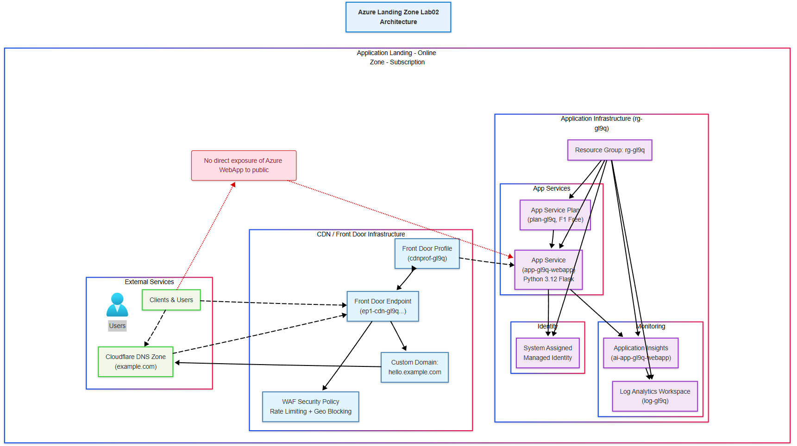
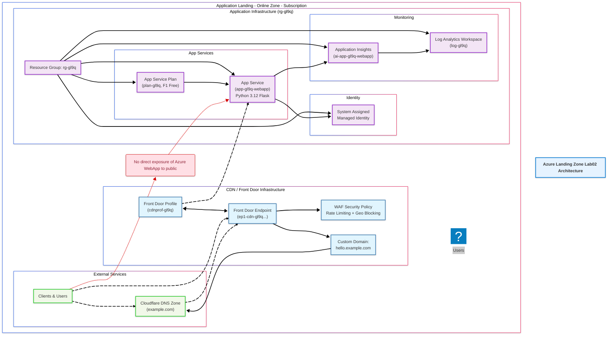

# azure-arch-landing-zone-lab02 - Application Landing Zone "Online"
Description: Azure Landing Zone - Application Zone

This zone deploys a Python Flask web application from GitHub, hosted on Azure App Service (Web App) with Application Insights monitoring, using Azure Verified Module (AVM) as template. This zone is dedicated to this application only, with policy deployment controlled by the platform-management zone.

## Cost-Optimized Configuration

- **Service Plan**: Linux F1 (Free tier) for demo purposes
- **Application Insights**: Basic monitoring for demo purposes
- **Azure Front Door Standard**: $35/month base fee + ~$0.01/GB data transfer + $0.009 per 10,000 requests
- **Estimated Monthly Cost**: $35-37/month (primarily from Front Door base fee)
- **Cloudflare DNS**: Register your own domain, can be used to replace Azure Front Door free of charge

## Prerequisites

Before deploying this application landing zone, ensure you have:

1. **Azure Subscription**: Dedicated subscription for application workloads
2. **Azure Landing Zone Platform**: Working platform zone (azure-arch-landing-zone-lab01)
3. **Terraform**: Version ~1.9 installed
4. **Azure CLI**: For local authentication and deployment
5. **Git**: For code cloning (can be installed via Azure CLI)

## Architecture Diagram



## Quick Start

### 1. Clone and Navigate to Directory

```bash
cd azure-arch-landing-zone-lab02
```

### 2. Configure Authentication

Choose one of the following authentication methods:

#### Option A: Azure CLI Authentication (Development)

```bash
# Login to Azure CLI
az login

# Set the subscription (replace with your subscription ID)
az account set --subscription "your-subscription-id"
```

#### Option B: Service Principal Authentication (CI/CD)

Create a service principal with appropriate permissions:

```bash
# Create service principal with contributor role
az ad sp create-for-rbac --name "alz-app-sp" --role contributor --scopes /subscriptions/your-subscription-id
```

Update the environment `.tfvars` file with the service principal credentials:

```hcl
client_id     = "your-sp-client-id"
client_secret = "your-sp-client-secret"
```

### 3. Configure Environment Variables

Edit one of the environment files in the `env/` directory:

```bash
# For development
cp env/dev.tfvars my-config.tfvars

# Edit the file with your subscription details
nano my-config.tfvars
```

**Required Variables:**
- `subscription_id`: Your Azure subscription ID
- `tenant_id`: Your Azure tenant ID
- Choose an authentication method (Azure CLI or Service Principal)

### 4. Initialize Terraform Backend

**First Deployment (Dev Environment):**

```bash
# Initialize with local backend first
terraform init

# Plan deployment
terraform plan -var-file="env/dev.tfvars"

# Apply deployment
terraform apply -var-file="env/dev.tfvars"
```

**Subsequent Deployments:**

The backend configuration will automatically switch to Azure Storage Account after first deployment.

### 5. Deployment Commands

#### Development Environment
```bash
terraform workspace select dev || terraform workspace new dev
terraform plan -var-file="env/dev.tfvars"
terraform apply -var-file="env/dev.tfvars"
```

## Configuration Details

### Backend Configuration

The Terraform backend is configured to use Azure Storage Account:

```hcl
backend "azurerm" {
  resource_group_name  = "rg-tfstate-${var.environment}"
  storage_account_name = "sttfstate${var.environment}${var.location_short}"
  container_name       = "tfstate-${var.application_name}"
  key                  = "${var.application_name}.tfstate"
}
```

### Authentication Methods

The provider supports multiple authentication methods:

1. **Azure CLI**: `use_cli = true` (default for development)
2. **Service Principal**: `client_id` and `client_secret`
3. **Certificate-based**: `client_certificate_path`
4. **Workload Identity**: `use_oidc = true` (recommended for GitHub Actions)

### Environment Variables

| Variable | Description | Example |
|----------|-------------|---------|
| `subscription_id` | Azure subscription ID | `12345678-1234-abcd-1234-123456789012` |
| `tenant_id` | Azure tenant ID | `87654321-4321-dcba-4321-210987654321` |
| `environment` | Environment name | `dev`, `staging`, `prod` |
| `application_name` | Application identifier | `online` |
| `location` | Azure region | `East US` |

## Architecture

This application landing zone deploys:

- **Azure Web App**: Linux-based hosting with Python Flask runtime (F1 Free tier)
- **App Service Plan**: F1 tier for cost-optimized hosting ($0/month)
- **Application Insights**: Basic monitoring and telemetry
- **GitHub Integration**: Source code deployment from GitHub repository
- **RBAC**: System-assigned managed identity for secure access

## Compliance and Security

The configuration includes:

- Azure provider security features
- Resource tagging according to Azure Landing Zone standards
- Telemetry controls (opt-in/opt-out)
- Environment isolation via workspaces
- State locking and versioning

## Troubleshooting

### Common Issues

1. **Subscription Access**: Ensure your account has contributor rights
2. **Backend Errors**: Check if storage account exists for state
3. **Authentication Errors**: Verify Azure CLI login or service principal credentials
4. **Provider Version**: Ensure AzureRM provider version compatibility

### Backend Initialization

If you encounter backend issues:

```bash
# Force reinitialize
terraform init -reconfigure

# Migrate existing state
terraform init -migrate-state
```
# Web App Deployment Guide

## Overview

The Terraform configuration automatically deploys a Python Flask application from GitHub. The Web App uses continuous integration or manual deployments with Azure CLI for updating code.

## Public vs Private Repository Authentication

The deployment script supports both public and private GitHub repositories:

### Public Repositories (No Authentication Required)

For public repositories, no authentication is needed:

```powershell
.\deploy-webapp.ps1 `
  -ResourceGroupName "rg-your-name" `
  -WebAppName "web-your-name-webapp" `
  -GitHubRepoUrl "https://github.com/Azure-Samples/msdocs-python-flask-webapp-quickstart" `
  -ConfigureGitHubDeployment $true
```

### Private Repositories (GitHub Token Required)

For private repositories, you must set the GITHUB_TOKEN environment variable:

```powershell
# Set the GitHub token first (replace with your actual token)
$env:GITHUB_TOKEN = "ghp_your_github_personal_access_token_here"

# Then run the deployment script
.\deploy-webapp.ps1 `
  -ResourceGroupName "rg-your-name" `
  -WebAppName "web-your-name-webapp" `
  -GitHubRepoUrl "https://github.com/your-org/private-repo" `
  -ConfigureGitHubDeployment $true
```

#### Creating a GitHub Personal Access Token

1. Go to GitHub → Settings → Developer settings → Personal access tokens → Tokens (classic)
2. Click "Generate new token (classic)"
3. Select scopes:
   - `repo` (Full control of private repositories)
   - `workflow` (if using GitHub Actions)
4. Copy the generated token
5. Set it as an environment variable: `$env:GITHUB_TOKEN = "your-token-here"`

**Security Note**: Never hardcode tokens in scripts or commit them to version control.

## ✨ Key Features

- **Cost-Optimized**: Uses B1 (~$13/month) or F1 (Free) App Service plans
- **Python Flask Ready**: Pre-configured with Python 3.12 and Flask framework
- **GitHub Integration**: Source control deployment from GitHub repository
- **Monitoring**: Application Insights integration for basic telemetry
- **Security**: HTTPS-only, system-assigned managed identity, secure settings
- **Azure Verified Modules**: Enterprise-ready, Microsoft-maintained infrastructure

## Deployment Instructions

### Step 1: Deploy Infrastructure

```bash
terraform init
terraform plan -var-file="env/dev.tfvars"
terraform apply -var-file="env/dev.tfvars"
```

### Step 2: Verify Web App

After Terraform completes, check that the Web App is deployed:

```bash
# Get the Web App URL
terraform output web_app_url

# Verify the deployment
az webapp show --name YOUR-WEBAPP-NAME --resource-group YOUR-RG-NAME
# Example
az webapp show --resource-group 'rg-gl9q' --name "app-gl9q-webapp"
```

### Step 3: Deploy Application Code

Use the deployment script to deploy your Flask application:

```powershell
# Deploy Web App from GitHub (recommended)
.\deploy-webapp.ps1 `
  -ResourceGroupName "rg-your-name" `
  -WebAppName "web-your-name-webapp" `
  -GitHubRepoUrl "https://github.com/Azure-Samples/msdocs-python-flask-webapp-quickstart" `
  -ConfigureGitHubDeployment $true

# Example
.\deploy-webapp.ps1 `
  -ResourceGroupName 'rg-gl9q' `
  -WebAppName "app-gl9q-webapp" `
  -GitHubRepoUrl "https://github.com/Azure-Samples/msdocs-python-flask-webapp-quickstart" `
  -ConfigureGitHubDeployment $true

# Or deploy manually via ZIP upload
.\deploy-webapp.ps1 `
  -ResourceGroupName "rg-your-name" `
  -WebAppName "web-your-name-webapp" `
  -GitHubRepoUrl "https://github.com/Azure-Samples/msdocs-python-flask-webapp-quickstart" `
  -ConfigureGitHubDeployment $false
```

### Step 4: Access Your Web App

```bash
# Get the Web App URL from Terraform outputs
terraform output web_app_url

# Or manually construct it: https://YOUR-WEBAPP-NAME.azurewebsites.net
```

## How the Web App Configuration Works

The Terraform configuration creates:

1. **App Service Plan**: Linux-based B1 tier (~$13/month) with Python support
2. **Web App**: Pre-configured with Python 3.12 and Flask framework
3. **Application Settings**: Optimized for production Flask deployment
4. **Health Checks**: Basic health monitoring for app stability
5. **Security**: HTTPS-only access with secure TLS 1.2
6. **Monitoring**: Application Insights for basic telemetry

### Automatic Features

- **Always On**: Prevents cold starts (available in B1, not F1 tier)
- **Health Check Path**: Monitors `/` endpoint for app health
- **Build During Deployment**: Automatic dependency installation
- **Flask Production Settings**: Optimized environment variables for production

## GitHub Deployment Methods

### Method 1: Azure GitHub Integration (Recommended)

The Web App can be configured to automatically deploy from GitHub by:

1. Using the deployment script with `-ConfigureGitHubDeployment $true`
2. Pushing changes to the configured branch in GitHub
3. Azure automatically pulls and deploys the updated code

### Method 2: Manual ZIP Deployment

For manual deployments or when GitHub integration is disabled:

1. Script clones the GitHub repository
2. Creates a ZIP archive of the code
3. Deploys via Azure CLI ZIP upload
4. Automatic dependency resolution during deployment

## Troubleshooting

### Common Issues

- **"Web App not responding"**: Check if using B1 tier (not F1 which has limitations)
- **"Python runtime not found"**: Verify the Terraform configuration included Python settings
- **"Dependencies not installing"**: Ensure requirements.txt exists in GitHub repository
- **"GitHub deployment failing"**: Verify repository URL and branch exist

### Web App Issues

- **"Traffic routing issues"**: Check if using "Always On" feature (B1 tier only)
- **"Cold start delays"**: Normal for F1 tier; consider upgrading to B1 for better performance
- **"Python packages failing"**: Verify all dependencies are in requirements.txt
- **"Flask app not loading"**: Check FLASK_APP environment variable configuration

### Manual Deployment Commands

If the automated script fails, deploy manually:

```bash
# Clone and prepare your repository
git clone https://github.com/Azure-Samples/msdocs-python-flask-webapp-quickstart app-code
cd app-code

# Create ZIP and deploy
az webapp deployment source config-zip \
  --resource-group YOUR-RG \
  --name YOUR-WEBAPP \
  --src app.zip
```

## Cost Analysis

| Component | Tier | Monthly Cost | Notes |
|-----------|------|--------------|-------|
| **App Service Plan** | F1 | $0 | Free tier with limitations |
| **Application Insights** | Basic | Minimal | Basic monitoring included |
| **Azure Front Door Standard** | Standard | $35 | Base fee + minimal usage costs |
| **Data Transfer** | N/A | $0.09/GB | First GB/month free |

**Total Estimated Cost: $35-37/month**

## Runtime Configuration

The Web App is pre-configured for Python Flask with:

```python
# app.py (expected structure)
from flask import Flask
app = Flask(__name__)

@app.route('/')
def hello_world():
    return 'Hello from Azure Web App!'

if __name__ == '__main__':
    app.run()
```

### Environment Variables Set

- `FLASK_APP=app.py`
- `FLASK_ENV=production`
- `PYTHONPATH=/home/site/wwwroot`
- `FLASK_RUN_HOST=0.0.0.0`
- `FLASK_RUN_PORT=8000`

### App Insights Integration

The Terraform configuration includes basic telemetry to track:
- Request/response times
- Error rates
- Performance metrics
- Custom events and logs

## Post-Deployment

Your setup provides:

- ✅ **Python Flask Web App** with Linux runtime
- ✅ **Automatic GitHub deployments** via source control integration
- ✅ **No initial serverless cold starts** (unlike Function Apps)
- ✅ **HTTPS encryption** and security headers
- ✅ **Application insights** for monitoring and debugging
- ✅ **Scale to your user needs** with basic tier

## Next Steps

1. **Test your application**: Visit the Web App URL and verify functionality
2. **Monitor performance**: Check Application Insights for request metrics
3. **Configure custom domain**: Add your own domain name
4. **Set up staging slots**: Enable blue-green deployments
5. **Configure backup**: Set up automated code and data backups
6. **Enable logging**: Configure more detailed application logs

For more information about Azure App Service, visit:
- [Azure App Service Documentation](https://docs.microsoft.com/en-us/azure/app-service/)
- [Azure Web Apps for Python](https://docs.microsoft.com/en-us/azure/app-service/quickstart-python)
- [Terraform Azure Provider](https://registry.terraform.io/providers/hashicorp/azurerm/latest/docs)

## Next Steps

After deploying the application landing zone:

1. **Configure Networking**: Connect to platform zone networking if needed
2. **Set up CI/CD**: Implement automated deployments
3. **Configure Monitoring**: Set up alerts and dashboards
4. **Security**: Implement security policies and access controls
5. **Documentation**: Update runbooks and deployment guides

For more information about Azure Landing Zones, visit:
- [Azure Landing Zone Documentation](https://learn.microsoft.com/en-us/azure/cloud-adoption-framework/ready/landing-zone/)
- [Terraform Azure Provider](https://registry.terraform.io/providers/hashicorp/azurerm/latest/docs)
- [Azure Web Apps for Python](https://docs.microsoft.com/en-us/azure/app-service/quickstart-python)
